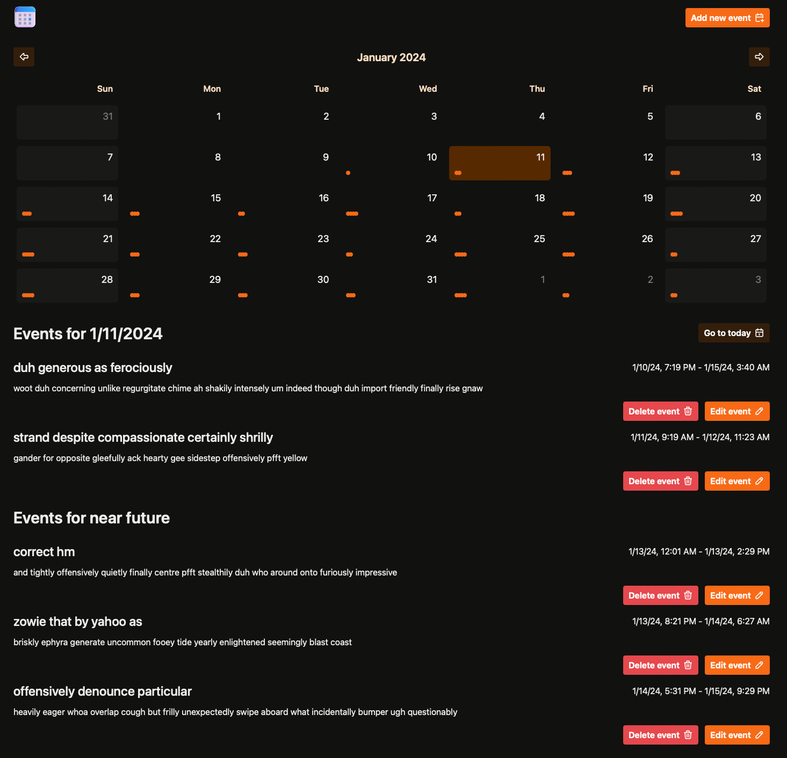

# Planner app styled with Tokenami

This project is a playground app that I've built and styled with both [Tokenami](https://github.com/tokenami/tokenami) and [TailwindCSS](https://github.com/tailwindlabs/tailwindcss).

[](https://planner-tokenami.vercel.app)

## Deployed versions

- [Tokenami version](https://planner-tokenami.vercel.app)
- [TailwindCSS version](https://planner-tailwind.vercel.app)

> [!IMPORTANT]
> Tokenami got some significant improvements since the first revision of this notes. I've updated it, feel free to check the history to see exact changes.

## What's Tokenami

Tokenami is unconventional approach that allows direct styling with inline styles in a typesafe manner. In comparison to other similar approaches e.g. [CSSHooks](https://css-hooks.com) (which also allows direct styling with inline styles), Tokenami utilizes CSS variables and cascade layers to deliver many powerful features, such as built-in theming, complex selectors and aliasing.

It also comes with built-in utility for merging and composing styles. Moreover, it provides a TS plugin for even better TypeScript integration. I highly recommend giving a read about all of these libraries, especially in terms of trade-offs and design decisions.

## Why I've built this

Tokenami started with utilizing unconventional approach with substring selectors. However, these are (in)famously known for a worse performance than other, especially when compared to class selectors which are one of the most performant one.

Hence, I wanted to measure it, how much the performance tanks from using the substring selectors. Moreover, I've just wanted to play a bit with Tokenami to get a grasp whether it's something for me. A lot of thanks to Tokenami author [jjenzz](https://twitter.com/jjenzz) that helped a lot during my journey with Tokenami and was ultra fast with fixing bugs or brainstorming my improvement ideas!

Since then a lot of experiments happened and even more unconventional approach emerged. Using `[style]` selector in combination of CSS layers allows you to basically recreate a standard CSS cascade in your own way. Moreover, the way the selectors like `hover` or `@media` rules work also got reworked . Now it uses space tricks with CSS variables, which got popularized by CSSHooks. It allows to e.g. switching all elements into focused state in the inspector.

In a lot of points I'm focusing on a comparison to TailwindCSS. That's because that's my currently preferred styling approach which I wanted to somehow "benchmark" against the new kid on the block.

## What do I like about Tokenami?

I've used Tokenami basically since it was available for any usage and I have a few things that I especially enjoy with it. Part of the list is really subjective so feel free to disagree 😄 Let's go through them!

### Authoring format

Styles are co-located with elements and don't need to be named, similarly to TailwindCSS - these are the characteristics that I'm looking for mostly. However, in opposite to TailwindCSS those can be easily (e.g. no need to worry about intellisense) extracted to variables or composed because they're plain objects. Moreover, it's easier to read and find specific styles on a given component. I find object syntax easier to read then atomic class names - even if the latter one is much faster to author.

Example of element styled by Tokenami from this project:

```tsx
import { css } from "@tokenami/css";

<header
	style={css({
		"--align-items": "center",
		"--display": "flex",
		"--justify-content": "space-between",
		"--hover_background-color": "var(--color_red-900)",
	})}
>
	...
</header>;
```

As you can see, standard properties are just prefixed with double `-` to make them CSS variables that Tokenami can use. Moreover, you can prefix them with selectors like `hover`. The other difference is the need to use the `css` utility, it allows few additional features and could be even more important in the future.

### Atomic stylesheet

Again, similarly to TailwindCSS - Tokenami generates an atomic stylesheet. That means that your stylesheet consists of mostly single-property selectors which can be reused across the whole project. That approach allows the stylesheet size to have some hard limit and reduces the growth rate.

Tbh, it's even more "atomic" then TailwindCSS - which generates CSS rules for each selector + value combination. Tokenami reduces it to just one rule for each selector. Values are handled by CSS variables.

Small part of stylesheet generated by Tokenami to give you a sense on how it's working:

```css
@layer tk-short {
	[style] {
		border-style: var(--border-style, revert-layer);
		border-color: var(--border-color, revert-layer);
		border-width: var(--border-width, revert-layer);
		border-radius: var(--border-radius, revert-layer);
		gap: var(--gap, revert-layer);
	}
}
```

It's also important to note that the author is working on a possibility of generating non-atomic sets of rules, which in specific scenarios could be beneficial. It also shows the flexibility that Tokenami offers.

### Theming and configuration

Tokenami comes with a well though theming approach. Yet again (😅), similarly to TailwindCSS, you have an option to restrict what values can be used with specific CSS properties. You can group a set of values under a theme key and than reference it in your properties configuration. You can match multiple theme keys to single property and even create your completely own theme keys, which is even more powerful then TailwindCSS on some levels.

It also has a handy "grid" config, which allows you to specify some base value, let's say `0.25rem` and then use multiplies of this when used. E.g. `"--margin-bottom": 4` would result in `1rem` margin with the before mentioned base. There's also a specific API for arbitrary one-off styles that you don't wish to specify in your theme.

It's important to note that Tokenami doesn't come with a theme built-in though. From what I talked to author, there's a possibility of plugin system in the future which would allow to share and ship those. Then, a base theme could be distributed as a plugin.

You can also configure other stuff, but overall the config is pretty straight-forward and minimal. One thing that I want to highlight is aliases. Let's say that writing "--background-color" each time can get tiring. You can easily alias it to e.g. `--bg-color` and use it across your project. You can see the specifics on how I configured Tokenami in this project in `.tokenami/tokenami.config.ts`.

### Easy and seamless integration into your project

In it's core it's just an CLI that watches your config and paths that you specified in it and generates a stylesheet. Run it in watch mode during the development and run it before build - you're basically good to go. There's no need for some specific bundler integrations or babel plugins. You can make it work within React Vite project, Next.js, Remix, CRA (I feel sorry) or SolidJS (more on that later).

The extraction is super flexible and simple, it just uses RegEx to extract all that look like Tokenami specific selector and generates rules for those. That's also pretty similar to TailwindCSS 😄 Despite generating rules only on properties you still can't create dynamically both selectors and values (if they're coming from theme), because Tokenami doesn't generate CSS rules for unused theme tokens.

### Simple, yet powerful API

As you already could see in few of these examples, there's no specific functions for applying styles or anything. Just use inline styles with Tokenami flavour and you get all of its power and flexibility. Moreover, as previously mentioned - styles declarations are plain objects, it makes them really powerful and composable. Let's give a few examples.

Firstly, you can always move styles out of inline `style` attribute and reuse them across different elements:

```tsx
import { css } from "@tokenami/css";

const styles = css({
	"--color": "var(--color_red-900)",
	"--background-color": "var(--color_red-100)",
	"--padding": 4,
});

const element1 = <div style={styles} />;
const element2 = <div style={styles} />;
```

Even better, you can extract part of styles or compose them together:

```tsx
import { css } from "@tokenami/css";

const styles = {
	"--color": "var(--color_red-900)",
	"--background-color": "var(--color_red-100)",
	"--padding": 4,
};

const commonFocusStyles = {
	"--focus-visible_outline-style": "var(--line-style_solid)",
	"--outline-color": "var(--color_blue-600)",
	"--outline-offset": 0.75,
	"--outline-width": 0.5,
};

const element1 = <div style={css(styles, commonFocusStyles)} />;

const { "--padding": _, ...baseStylesWithoutPadding } = styles;

const element2 = <div style={css({ ...baseStylesWithoutPadding, ...commonFocusStyles })} />;
```

Moreover it's also capable of merging conflicting styles:

```tsx
import { css } from "@tokenami/css";

const styles = {
	"--color": "var(--color_red-900)",
	"--background-color": "var(--color_red-100)",
	"--padding-left": 4,
};

const conflictingStyles = {
	"--padding": 8,
};

const element = <div style={css(styles, conflictingStyles)} />;
```

That looks sweet! It even properly knows that `--padding` is shorthand that sets `--padding-left` and will overwrite it. Moreover the same `css` function also acts as a tool for managing variants! Let's look at following example from my codebase (slightly simplified):

```tsx
import { css } from "@tokenami/css";

const button = css.compose({
	"--border-radius": "var(--radii_base)",
	"--color": "var(--color_white)",
	"--outline-color": "var(--color_blue-8)",
	"--outline-offset": 0.75,
	"--outline-width": 0.5,
	"--px": 2.5,
	"--py": 2,
	"--focus-visible_outline-style": "var(--line-style_solid)",

	variants: {
		variant: {
			base: {
				"--bg-color": "var(--color_orange-9)",
				"--hover_bg-color": "var(--color_orange-10)",
			},
			muted: {
				"--bg-color": "var(--color_orange-3)",
				"--hover_bg-color": "var(--color_orange-4)",
			},
			negative: {
				"--bg-color": "var(--color_red-9)",
				"--hover_bg-color": "var(--color_red-10)",
			},
		},
	},
});

const exampleButtonBase = <button style={button({ variant: "base" })} />;

const additionalStylesThatTakesPriority = {
	"--p": 4,
};

const exampleButtonMuted = <button style={button({ variant: "muted" }, additionalStylesThatTakesPriority)} />;
```

As you can see, the API that Tokenami provides is pretty minimal. However, it allows to use the flexibility of JavaScript to create super powerful patterns and compose styles in a way that's unmatched by TailwindCSS.

### TypeScript as a first-class citizen

Tokenami makes solid use of TypeScript possibilities, thanks to usage of object notation for styles authoring it's possible to typecheck those. You will see if property that you're trying to set doesn't exist. It goes even further though, because you get typesafety for theme values, selectors, and breakpoints. There's also a special way of expressing an arbitrary value in a typesafe manner `var(---, arbitrary value goes here)`. Moreover, it utilizes a TypeScript plugin to achieve even more stuff - e.g. you get hints on what hides under specific themes value during autocompletion.

There're also a few goodies created especially for squeezing even more from TypeScript in Tokenami projects. Firstly, you have a simple type `TokenamiProperties` that you can use anywhere to declare styles and get intellisense and type-checking. In previous point I mentioned an API for declaring variants, it also has a type helper for extracting those at type level `Variants`.

And time for the stuff that excites me the most - you often want to create a component and expose most of the underlying element properties for external usage. Let's say you want to let user apply styles like margins or grid/flex related properties, but you don't want them to override your design. With Tailwind you have basically two options, create a special API that maps those to properties, or allow all classes - you can't really limit what classes someone passes in. Both approaches have some downsides. In Tokenami, you have a third, proffered way - `TokenamiPropertiesOmit` and `TokenamiPropertiesPick` type helpers. Look at below example:

```tsx
// This type will allow assigning everything except of a few selected ones
type PropertiesWithoutBackground = TokenamiPropertiesOmit<"background" | "background-color" | "background-image">;

// This type will allow assigning only a few selected ones
type MarginAndFlexProperties = TokenamiPropertiesPick<
	"flex" | "flex-basis" | "flex-grow" | "flex-shrink" | "margin" | "margin-left" | "margin-right" | "margin-top"
>;
```

It also takes into account stuff like aliases or responsive selectors. This API is similar to what [StyleX](https://stylexjs.com/docs/learn/static-types/) recently shown, but is modeled after TypeScript `Pick` and `Omit` helpers.

The intellisense is also a bit easier to work with than TailwindCSS in my opinion. The latter one utilizes RegEx to know where it should autocomplete specific class names. Tokenami one is powered by TypeScript, so you can expect it to work in similar fashion as all other autocompletion.

### Interesting usage of CSS

It's just a straight up super interesting usage of flexibility that CSS offers. Even if you won't use it, it's a good showcase of what you can use while building frontend with other styling solutions.

## What are the tradeoffs in my opinion?

Okay, but the sun isn't always shining 😄 There must be some tradeoffs for all the nice stuff that I mentioned before. I won't focus on stuff like "smaller ecosystem" or "maturity" because that's pretty obvious for a library that's less then a month from a public release. Let's go through the real tradeoffs:

### Performance

When I mean "performance" it relates to a few of things. Firstly, the CSS selectors performance. Tokenami already improved a lot in this case since release, substring selectors got replaced by CSS layers and `[style]` selector. My contender is TailwindCSS and Tokenami is slower, you can't argue that. I don't want to say "it's fast enough" or "it's much slower", that probably all depends on your needs. I've put a few metrics in later part of this so you can make your own thoughts. It's also important to note, that my contender is kinda good in this category. If you're using something like runtime CSS-in-JS solution, it could be possible that Tokenami is much faster. As I mentioned before - if that's your concern, look at below metrics and make your own thoughts, I won't decide for you 😄

It's also important to note that if you're using stuff like `cva` and `tw-merge` extensively in runtime, the performance hit from those could mitigate some of the gains from using TailwindCSS. Built-in `css` in Tokenami is much faster, because it doesn't need to utilize RegExes for deduplication and merging.

Second part of the "performance" is the TypeScript performance - mainly `tsc` and the intellisense. As I mentioned before, Tokenami makes it possible to typecheck basically everything - that must come with a performance hit. Doing some work is always slower than not doing it at all. It tries to offload as much as possible during development to the plugin but you still get some slowdowns. Moreover, TypeScript doesn't allow running plugins during `tsc`, so in CI you can't offload it.

### Works best with JavaScript, TypeScript files

Currently Tokenami supports React and SolidJS, but it could easily grow in the future. Currently to use it to the fullest, the prerequisites are - object notation for inline style attribute and usage of TypeScript/JavaScript files where you author styles. In theory, both of them aren't obligatory, you can just write inline styles like I did in `index.html` file:

```html
<body
	style="--background-color: var(--color_sand-1); --color: var(--color_sand-12); --font-family: var(--font_sans)"
></body>
```

But you are missing both the typesafety and intellisense with this. Moreover, the usage of TypeScript plugin can be a limitation when using it with custom languages like `svelte` or `vue`. On the other hand, most of frameworks that utilize JSX seems to be easily integrable, e.g. addition of Qwik seems pretty straightforward.

## Summary

Before going into the measurements that I mentioned before - a quick summary. Tokenami is super powerful styling solution that integrates nicely with TypeScript, it comes with built-in theming and utilities for merging styles and managing variants. It utilizes CSS variables to make inline styles capable of more stuff. The integration with project is pretty basic, you only need to run a CLI. The DX you get is pretty lit. There're few tradeoffs, mostly related to performance but that all depends on your specific use-case and your current solution.

## Various measurements

Okay, let's go to the part that's probably more spicey 😄 I'm not taking conclusions, anyone can decide for themselves. Few notes before presenting rough numbers:

- I'm comparing it with TailwindCSS, because that's my current go-to styling solution
- I'm using different CSS resets with both libraries. TailwindCSS comes with a one builtin. Both seems to be similar in terms of selectors performance but the TailwindCSS is slightly bigger.
- The measurements aren't lab-grade. I didn't care about ultra precision and automation, because I'm building it for myself mostly. It involves measuring user interactions performed by human. The variance is mitigated by measuring single interaction times, so these shouldn't matter too much (it measures stuff **after** I clicked something). Also benchmarking isn't my specialization, take it with a grain of salt.
- There's small variance between both calendars content, I've used `faker.js` to generate mock events so stuff like event spread and longer/shorter names could impact some stuff in theory. You can take a look in `src/lib/mock-data.ts` to check how I generated it. Generating different data sets didn't seem to impact it though.
- I'm using an experimental setting with TailwindCSS `optimizeUniversalDefaults`. This one makes the resulting stylesheet smaller and remove few less performant selectors. I have this always on when I'm using TailwindCSS and as I mentioned before - these measurements are mostly for me so I've included it here also.
- My machine is MacBook Pro 14" M1 with 16GB RAM, all measurements were taken with Microsoft Edge (chromium under the hood).

### Size

|                 | Tokenami | Tokenami gzip | TailwindCSS | TailwindCSS gzip |
| --------------- | -------- | ------------- | ----------- | ---------------- |
| Stylesheet size | 7.95 kB  | 2.23 kB       | 8.62 kB     | 2.73 kB          |

As you can see, Tokenami has smaller stylesheet size. The gap will probably grow with the size of the app (as mentioned before, Tokenami generates rules for every property, while TailwindCSS for every property + value combination). However, the difference shouldn't skyrocket or anything - both solutions use atomic rules.

|            | Tokenami  | Tokenami gzip | TailwindCSS | TailwindCSS gzip |
| ---------- | --------- | ------------- | ----------- | ---------------- |
| JS(X) size | 545.15 kB | 171.03 kB     | 557.53 kB   | 176.58 kB        |

This app is an SPA so HTML size is basically included in this one as JSX. Don't be afraid by the big numbers, that's mainly caused by some hefty libraries that I choose in this project (unrelated to styling), both Tokenami and Tailwind doesn't incur too big JS cost. However, this is influenced by styling solution in two ways - firstly, how terse are styles declarations, secondly - companion libraries. I'm usually using TailwindCSS in conjunction with CVA and tw-merge, Tokenami comes with a one built-in, so these are included here. Generally even if it looks like Tokenami is in the lead - it's important to note that that size is spread out differently. CVA + tw-merge for TailwindCSS is much bigger than Tokenami `css` utility. On the other hand, the styles declarations with Tokenami are bigger.

### Timings **(paint + rendering only)**

|                            | Tokenami | TailwindCSS |
| -------------------------- | -------- | ----------- |
| Interaction                | 17ms     | 24ms        |
| Interaction, 4x slowdown   | 69ms     | 79ms        |
| Initial Paint              | 31ms     | 20ms        |
| Initial Paint, 4x slowdown | 131ms    | 92ms        |

As you can see, interactions timing are pretty similar, even slightly favouring Tokenami in my measurements. However, Initial Paint timings slumps a bit. "Interaction" is changing date on the calendar inside of the app and measuring how long does it take to update, it doesn't include the hovering part to mitigate human impact.

### Selectors

Microsoft Edge has this nice selector tab that lets you see how much time exact selectors took. Here I'm putting example screenshots from the "Initial Paint, 4x slowdown" test. Treat this metric with caution I find this selectors performance really vary run-to-run. I've included it more as an interesting fact and please treat it more like a general idea of which selectors are slow and what can be improved.

#### TailwindCSS


#### Tokenami


I've sorted them by how fast are they and in case of TailwindCSS not all were fitting my screen but they were zero time anyway so I didn't care 😄

### Timings (merging classes)

|                    | Tokenami | TailwindCSS |
| ------------------ | -------- | ----------- |
| Small, 6x slowdown | 1.2ms    | 8ms         |
| Big, 6x slowdown   | 7.8ms    | 22ms        |

As mentioned before, I've setup both libraries with utilities for merging styles and managing variants. I'm aware the Tailwind one isn't as performant, because it uses RegExes for merging and deduplication. I've decided to create example scenarios and test them. You can see specific cases in `src/lib/benchmark.ts` in both projects.

As you can see, the difference is quite noticeable and can scale especially with many components on a given page. However, this mostly impacts initial paints or app navigations, because both libraries utilize caching for already encountered combinations.

### Timings (tsc)

|                          | Tokenami | TailwindCSS |
| ------------------------ | -------- | ----------- |
| Running `pnpm typecheck` | 6.91s    | 2.35s       |

As mentioned before, the TypeScript performance takes a hit while using Tokenami. It's not really noticeable during normal usage (except of Tokenami properties intellisense), because of smart magic with TS plugin. However, it's really prominent while running the `tsc` e.g. during CI. It's also important to note that TailwindCSS classes aren't typechecked, these are just string, while with Tokenami you're getting typechecking for literally everything.

If you're here, thanks for taking a look and reading through my thoughts 😊
